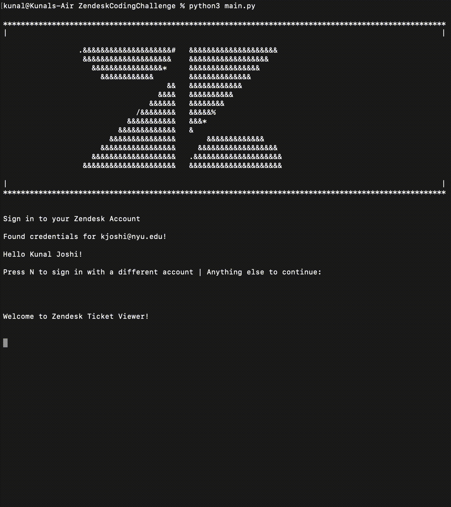

# Zendesk Ticket Viewer
Created as part of the Zendesk Coding Challenge.

---
## Features
- Connect to Zendesk API
- Request all the tickets for your account
- Display tickets in a list (with pagination)
- Display individual ticket details

---

## Setup
Install all requirements for `python3`. Make sure to upgrade `pip` before.
```console
pip install -r requirements.txt
```

## Usage
```console
python3 main.py
```
You will be asked for login credentials on first run. These are stored locally in an encrypted Config.ini file. 
This will be decrypted in future runs for ease of access.



## Testing
The `pytest` library is used for unit testing. Tests are under the `tests/` directory.
```console
python3 -m pytest
```
The code has been tested on macOS 11.5.2 and CentOS 7.9. It has not been tested on Windows. However, the code does not contain OS specific libraries.
